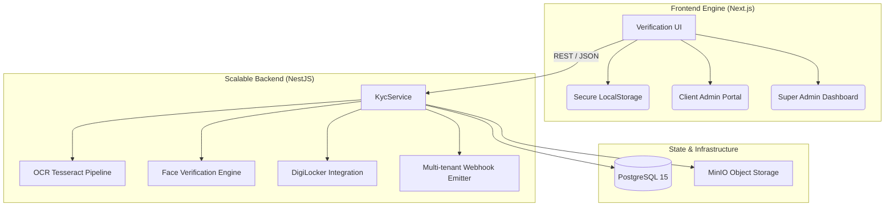

# EnxtAI KYC System

> Enterprise-grade, full-stack automated KYC verification system leveraging AI-powered OCR and facial recognition.

## 📋 Overview
EnxtAI KYC System is a scalable platform that automates document-based identity verification. Built to support FinTech operations, it enables secure document upload, text extraction, live liveness checks, and role-based operational dashboards.

**Core Capabilities:**
- **Document Integration**: PAN, Aadhaar, Live Photo capture, and DigiLocker OAuth fetching.
- **AI Pipelines**: OCR via `Tesseract.js` and local face verification using `face-api.js` (TensorFlow).
- **Multi-Tenant Security**: Role-based isolated access for End Users, Partner FinTechs (Client Admin), and Super Admins.
- **Data Security**: On-prem/private S3 bucket routing via MinIO with AES-256 encryption.

## 🏗️ Architecture


```mermaid
graph TB
    subgraph "Frontend Engine (Next.js)"
        A[Verification UI] --> B(Secure LocalStorage)
        A --> C(Client Admin Portal)
        A --> D(Super Admin Dashboard)
    end

    subgraph "Scalable Backend (NestJS)"
        E[KycService] --> F[OCR Tesseract Pipeline]
        E --> G[Face Verification Engine]
        E --> H[DigiLocker Integration]
        E --> I[Multi-tenant Webhook Emitter]
    end

    subgraph "State & Infrastructure"
        J[(PostgreSQL 15)]
        K[MinIO Object Storage]
    end

    A -- REST / JSON --> E
    E --> J
    E --> K
```

## 🔐 Portals & Authentication

| Portal Type | Endpoint | Access Requirement |
|-------------|----------|--------------------|
| **End User Flow** | `/` | Stateless public URL (Powered by `X-API-KEY`) |
| **Client Portal** | `/client/login` | Secure JWT Session. For FinTech organizations to monitor submissions. |
| **Super Admin** | `/admin/login` | Secure JWT Session. For EnxtAI administrators. |

## 🚀 Quickstart & Installation

**Prerequisites:** Node 20+, pnpm 8+, and Docker.

1. **Clone & Install**
   ```bash
   git clone https://github.com/your-org/enxtai-kyc-system.git
   cd enxtai-kyc-system
   pnpm install
   ```

2. **Boot Infrastructure**
   ```bash
   docker-compose up -d
   cd apps/api
   pnpm prisma migrate dev
   ```

3. **Start Applications**
   Make sure you have correctly mapped `.env` configurations for both `apps/web` and `apps/api`.
   ```bash
   pnpm dev
   ```
   - **Frontend**: http://localhost:3000
   - **Backend API**: http://localhost:3001
   - **MinIO Dashboard**: http://localhost:9001 (minioadmin / minioadmin)

## 🐳 Production Deployment

The system is configured for split deployments matching modern serverless + EC2 topographies.

- **Frontend (Web)**: Engineered for Vercel deployment without heavy native dependencies.
- **Backend (API + MinIO)**: Dockerized for AWS EC2 orchestration.
  - Run `docker compose --env-file .env.aws -f docker-compose.aws.yml up -d --build` on the target server.
  - Ensure SSL/TLS proxy routing via NGINX or AWS ALB.

## ⚙️ Development Guides

* **Adding Migrations**: Use `pnpm prisma migrate dev --name <description>`
* **Testing API Keys Locally**: You can use Ngrok to safely simulate origin request patterns for strict Tenant Verification rules. See your codebase logic for URL whitelisting constraints.
* **Component Styling**: Styled comprehensively utilizing `lucide-react` and standard `tailwind-merge` paradigms.

---
**Maintained by the EnxtAI Team.** For support, contact support@enxtai.com.
