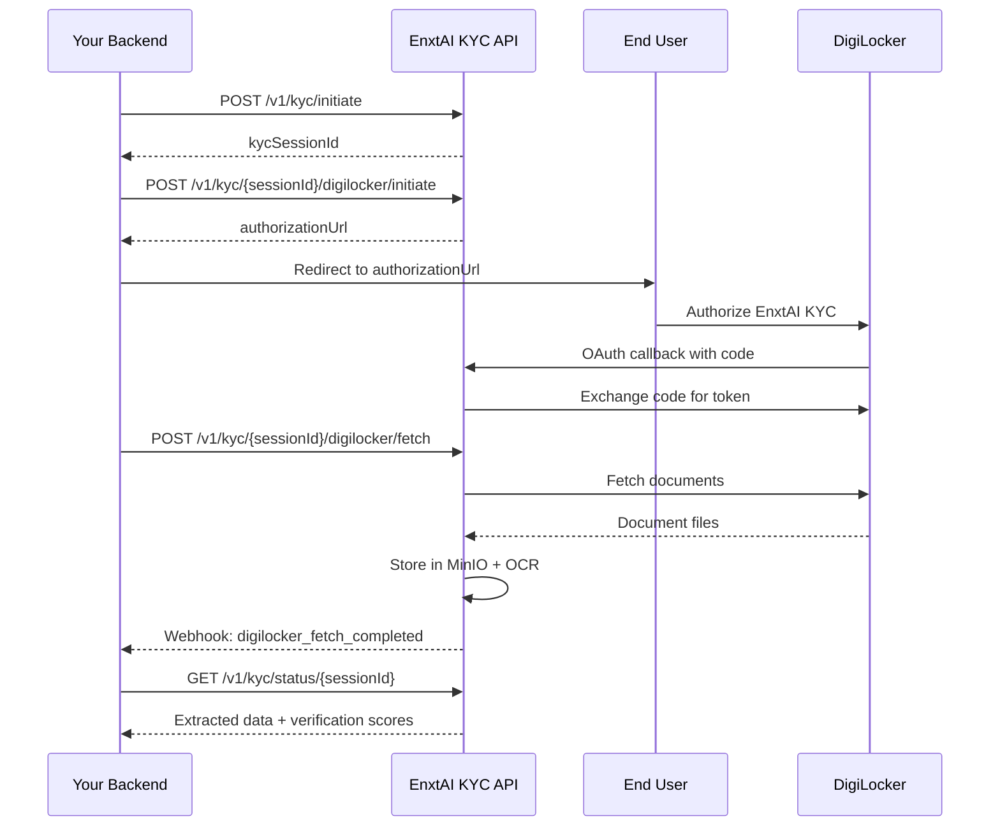

# EnxtAI KYC API Integration Guide

Complete guide for integrating the EnxtAI KYC verification API into your application.

---

## Table of Contents

1. [Getting Started](#getting-started)
2. [Authentication](#authentication)
3. [API Endpoints](#api-endpoints)
4. [Webhook Setup](#webhook-setup)
5. [Error Handling](#error-handling)
6. [Rate Limits](#rate-limits)
7. [Code Examples](#code-examples)

---

## Getting Started

### Prerequisites

- Active EnxtAI KYC account
- API key (obtain from client portal)
- HTTPS endpoint for webhook notifications (optional but recommended)

### Base URL

- **Development**: `http://localhost:3001/api`
- **Production**: `https://api.enxtai.com/api`

### Quick Start (5 minutes)

1. Obtain API key from client portal
2. Initiate KYC session with user's external ID
3. Upload documents (PAN, Aadhaar front/back, live photo)
4. Poll status endpoint or receive webhook notification
5. Handle verification result (VERIFIED/REJECTED)

---

## Authentication

All API requests require an API key passed in the `X-API-Key` header.

### Obtaining API Key

1. Log in to client portal: `https://portal.enxtai.com`
2. Navigate to Settings → API Keys
3. Copy your API key (shown only once)
4. Store securely (treat like a password)

### Using API Key

**HTTP Header:**
```
X-API-Key: your-api-key-here
```

**Security Best Practices:**
- Never commit API keys to version control
- Use environment variables: `process.env.ENXTAI_API_KEY`
- Rotate keys periodically (regenerate in portal)
- Use separate keys for development and production

---

## API Endpoints

### 1. Initiate KYC Session

**Endpoint:** `POST /v1/kyc/initiate`

**Description:** Creates a new KYC verification session for your end-user.

**Request Headers:**
```
X-API-Key: your-api-key-here
Content-Type: application/json
```

**Request Body:**
```json
{
  "externalUserId": "customer-12345",
  "email": "john.doe@example.com",
  "phone": "+919876543210",
  "metadata": {
    "transactionId": "txn-abc-123",
    "source": "mobile-app"
  }
}
```

**Response (201 Created):**
```json
{
  "kycSessionId": "a1b2c3d4-e5f6-4a7b-8c9d-0e1f2a3b4c5d",
  "status": "PENDING",
  "uploadUrls": {
    "pan": "/v1/kyc/upload/pan",
    "aadhaarFront": "/v1/kyc/upload/aadhaar/front",
    "aadhaarBack": "/v1/kyc/upload/aadhaar/back",
    "livePhoto": "/v1/kyc/upload/live-photo"
  }
}
```

---

### 2. Upload PAN Card

**Endpoint:** `POST /v1/kyc/upload/pan`

**Description:** Uploads PAN card document image.

**Request Headers:**
```
X-API-Key: your-api-key-here
Content-Type: multipart/form-data
```

**Multipart Form Fields:**
- `externalUserId` (text): Your user identifier (e.g., "customer-12345")
- `file` (file): PAN card image (JPEG/PNG, max 5MB)

**File Requirements:**
- MIME types: `image/jpeg`, `image/png`
- Max size: 5MB
- Min dimensions: 300x300px
- Max dimensions: 8192x8192px

**Response (200 OK):**
```json
{
  "success": true,
  "kycSessionId": "a1b2c3d4-...",
  "documentUrl": "kyc-abc123-pan/user-uuid/PAN_CARD_1735987654321.jpg"
}
```

---

### 3. Upload Aadhaar Front

**Endpoint:** `POST /v1/kyc/upload/aadhaar/front`

**Description:** Uploads Aadhaar card front side (with photograph).

**Request:** Same as PAN upload (multipart/form-data)

---

### 4. Upload Aadhaar Back

**Endpoint:** `POST /v1/kyc/upload/aadhaar/back`

**Description:** Uploads Aadhaar card back side (with address).

**Request:** Same as PAN upload (multipart/form-data)

---

### 5. Upload Live Photo

**Endpoint:** `POST /v1/kyc/upload/live-photo`

**Description:** Uploads user's live photograph for face verification.

**Request:** Same as PAN upload (multipart/form-data)

**Note:** This triggers automatic face verification after upload completes.

---

### 6. Get KYC Status

**Endpoint:** `GET /v1/kyc/status/:kycSessionId`

**Description:** Retrieves detailed status information for a KYC session.

**Request Headers:**
```
X-API-Key: your-api-key-here
```

**Response (200 OK):**
```json
{
  "kycSessionId": "a1b2c3d4-...",
  "externalUserId": "customer-12345",
  "status": "FACE_VERIFIED",
  "progress": 100,
  "extractedData": {
    "panNumber": "ABCDE1234F",
    "aadhaarNumber": "XXXX XXXX 1234",
    "fullName": "JOHN DOE",
    "dateOfBirth": "1990-01-15",
    "address": "123 Main St, Mumbai, MH 400001"
  },
  "verificationScores": {
    "faceMatchScore": 0.95,
    "livenessScore": 0.88
  },
  "createdAt": "2026-01-05T10:30:00Z",
  "updatedAt": "2026-01-05T10:45:00Z"
}
```

**Status Values:**
- `PENDING`: Session created, awaiting documents
- `DOCUMENTS_UPLOADED`: All documents received, processing started
- `OCR_COMPLETED`: Text extraction complete
- `FACE_VERIFIED`: Auto-approved (scores ≥ thresholds)
- `PENDING_REVIEW`: Manual review required (scores < thresholds)
- `VERIFIED`: Admin approved
- `REJECTED`: Admin rejected or verification failed

---

### 7. Trigger Verification (Optional)

**Endpoint:** `POST /v1/kyc/verify`

**Description:** Manually triggers face verification. Optional - verification auto-triggers after live photo upload.

**Request Body:**
```json
{
  "kycSessionId": "a1b2c3d4-..."
}
```

**Response (200 OK):**
```json
{
  "success": true,
  "status": "FACE_VERIFIED",
  "faceMatchScore": 0.95,
  "livenessScore": 0.88
}
```

---

## Webhook Setup

### Overview

Webhooks provide real-time notifications when KYC status changes. Configure your webhook endpoint in the client portal.

### Configuration Steps

1. Log in to client portal
2. Navigate to Settings → Webhooks
3. Enter your HTTPS endpoint URL
4. Generate webhook secret (or provide your own)
5. Click "Test Webhook" to verify connectivity
6. Save configuration

### Webhook Events

| Event | Description | Trigger |
|-------|-------------|---------|
| `kyc.documents_uploaded` | All documents uploaded | After live photo upload |
| `kyc.verification_completed` | Face verification done | After verification completes |
| `kyc.status_changed` | Admin changed status | Manual approval/rejection |

### Webhook Payload Format

**HTTP Headers:**
```
Content-Type: application/json
X-Signature: {hmac-sha256-signature}
X-Event: kyc.verification_completed
```

**Payload:**
```json
{
  "id": "evt_a1b2c3d4-e5f6-4a7b-8c9d-0e1f2a3b4c5d",
  "event": "kyc.verification_completed",
  "timestamp": "2026-01-05T10:35:00.000Z",
  "data": {
    "kycSessionId": "sub_123abc-456def-789ghi",
    "externalUserId": "customer-456",
    "status": "FACE_VERIFIED",
    "extractedData": {
      "panNumber": "ABCDE1234F",
      "aadhaarNumber": "XXXX XXXX 1234",
      "fullName": "John Doe",
      "dateOfBirth": "1990-01-15"
    },
    "verificationScores": {
      "faceMatchScore": 0.87,
      "livenessScore": 0.92
    }
  }
}
```

### Webhook Payload JSON Schema

```json
{
  "$schema": "https://json-schema.org/draft/2020-12/schema",
  "type": "object",
  "required": ["id", "event", "timestamp", "data"],
  "properties": {
    "id": {
      "type": "string",
      "format": "uuid",
      "description": "Unique webhook delivery identifier"
    },
    "event": {
      "type": "string",
      "enum": [
        "kyc.documents_uploaded",
        "kyc.verification_completed",
        "kyc.status_changed"
      ],
      "description": "Type of webhook event"
    },
    "timestamp": {
      "type": "string",
      "format": "date-time",
      "description": "ISO 8601 timestamp when event occurred"
    },
    "data": {
      "type": "object",
      "required": ["kycSessionId", "externalUserId", "status"],
      "properties": {
        "kycSessionId": {
          "type": "string",
          "format": "uuid",
          "description": "KYC session identifier"
        },
        "externalUserId": {
          "type": "string",
          "description": "Client's user identifier"
        },
        "status": {
          "type": "string",
          "enum": [
            "PENDING",
            "DOCUMENTS_UPLOADED",
            "OCR_COMPLETED",
            "FACE_VERIFIED",
            "PENDING_REVIEW",
            "VERIFIED",
            "REJECTED"
          ],
          "description": "Current KYC verification status"
        },
        "extractedData": {
          "type": "object",
          "description": "Extracted identity data from documents (optional)",
          "properties": {
            "panNumber": {
              "type": "string",
              "description": "PAN card number (optional)"
            },
            "aadhaarNumber": {
              "type": "string",
              "description": "Masked Aadhaar number (optional)"
            },
            "fullName": {
              "type": "string",
              "description": "Full name extracted from documents (optional)"
            },
            "dateOfBirth": {
              "type": "string",
              "format": "date",
              "description": "Date of birth in YYYY-MM-DD format (optional)"
            },
            "address": {
              "type": "string",
              "description": "Address extracted from Aadhaar back (optional)"
            }
          }
        },
        "verificationScores": {
          "type": "object",
          "description": "Biometric verification scores (optional)",
          "properties": {
            "faceMatchScore": {
              "type": "number",
              "minimum": 0.0,
              "maximum": 1.0,
              "description": "Face match confidence score (optional)"
            },
            "livenessScore": {
              "type": "number",
              "minimum": 0.0,
              "maximum": 1.0,
              "description": "Liveness detection score (optional)"
            }
          }
        }
      }
    }
  }
}
```

### Signature Verification

**Why Verify Signatures?**
- Ensures webhook is from EnxtAI (not spoofed)
- Prevents tampering with payload
- Required for production security

**Verification Steps:**

1. Extract `X-Signature` header from request
2. Compute HMAC-SHA256 of raw request body using your webhook secret
3. Compare computed signature with received signature
4. Reject webhook if signatures don't match

**Node.js Example:**
```javascript
const crypto = require('crypto');

function verifyWebhookSignature(req, webhookSecret) {
  const receivedSignature = req.headers['x-signature'];
  const payload = JSON.stringify(req.body);

  const expectedSignature = crypto
    .createHmac('sha256', webhookSecret)
    .update(payload)
    .digest('hex');

  if (receivedSignature !== expectedSignature) {
    throw new Error('Invalid webhook signature');
  }

  return true;
}

// Express.js webhook handler
app.post('/webhooks/kyc', (req, res) => {
  try {
    verifyWebhookSignature(req, process.env.WEBHOOK_SECRET);

    const { event, data } = req.body;

    switch (event) {
      case 'kyc.verification_completed':
        console.log(`KYC completed for user ${data.externalUserId}`);
        // Update your database, send email, etc.
        break;
      case 'kyc.status_changed':
        console.log(`KYC status changed to ${data.status}`);
        break;
    }

    res.status(200).send('OK');
  } catch (error) {
    console.error('Webhook verification failed:', error);
    res.status(401).send('Unauthorized');
  }
});
```

**Python Example:**
```python
import hmac
import hashlib
import json

def verify_webhook_signature(request, webhook_secret):
    received_signature = request.headers.get('X-Signature')
    payload = request.get_data(as_text=True)

    expected_signature = hmac.new(
        webhook_secret.encode('utf-8'),
        payload.encode('utf-8'),
        hashlib.sha256
    ).hexdigest()

    if received_signature != expected_signature:
        raise ValueError('Invalid webhook signature')

    return True

# Flask webhook handler
@app.route('/webhooks/kyc', methods=['POST'])
def handle_webhook():
    try:
        verify_webhook_signature(request, os.environ['WEBHOOK_SECRET'])

        data = request.json
        event = data['event']

        if event == 'kyc.verification_completed':
            print(f"KYC completed for user {data['data']['externalUserId']}")
            # Update database, send notification, etc.

        return 'OK', 200
    except ValueError as e:
        print(f'Webhook verification failed: {e}')
        return 'Unauthorized', 401
```

### Webhook Best Practices

1. **Idempotency**: Use `webhook.id` to detect duplicate deliveries
2. **Timeout**: Respond within 10 seconds (process async if needed)
3. **Retry Logic**: EnxtAI retries failed webhooks (exponential backoff)
4. **Logging**: Log all webhook deliveries for debugging
5. **Security**: Always verify signatures in production

---

## Error Handling

### HTTP Status Codes

| Code | Meaning | Action |
|------|---------|--------|
| 200 | Success | Process response |
| 201 | Created | Resource created successfully |
| 400 | Bad Request | Fix request body/parameters |
| 401 | Unauthorized | Check API key |
| 403 | Forbidden | Session belongs to different client |
| 404 | Not Found | Resource doesn't exist |
| 413 | Payload Too Large | Reduce file size (<5MB) |
| 429 | Too Many Requests | Implement rate limiting/backoff |
| 500 | Internal Server Error | Retry with exponential backoff |

### Error Response Format

```json
{
  "statusCode": 400,
  "message": "Invalid file type. Only JPEG and PNG are supported.",
  "error": "Bad Request"
}
```

### Retry Strategy

**Transient Errors (500, 503):**
- Retry with exponential backoff: 1s, 2s, 4s, 8s
- Max 5 retries
- Log failures for investigation

**Client Errors (400, 401, 404):**
- Do NOT retry (fix request first)
- Log error details
- Alert development team

**Rate Limit (429):**
- Wait for `Retry-After` header duration
- Implement client-side rate limiting
- Consider upgrading plan if persistent

---

## Rate Limits

### Current Limits

- **100 requests per minute** per API key
- Applies to all endpoints
- Resets every 60 seconds

### Rate Limit Headers

```
X-RateLimit-Limit: 100
X-RateLimit-Remaining: 87
X-RateLimit-Reset: 1704451200
```

### Handling Rate Limits

**Node.js Example (with retry):**
```javascript
const axios = require('axios');

async function makeApiRequest(url, options, retries = 3) {
  try {
    return await axios(url, options);
  } catch (error) {
    if (error.response?.status === 429 && retries > 0) {
      const retryAfter = error.response.headers['retry-after'] || 60;
      console.log(`Rate limited. Retrying after ${retryAfter}s...`);
      await new Promise(resolve => setTimeout(resolve, retryAfter * 1000));
      return makeApiRequest(url, options, retries - 1);
    }
    throw error;
  }
}
```

---

## Code Examples

### Complete Integration (Node.js)

```javascript
const axios = require('axios');
const FormData = require('form-data');
const fs = require('fs');

const API_BASE_URL = 'https://api.enxtai.com/api';
const API_KEY = process.env.ENXTAI_API_KEY;

const client = axios.create({
  baseURL: API_BASE_URL,
  headers: { 'X-API-Key': API_KEY },
});

// Step 1: Initiate KYC
async function initiateKyc(externalUserId, email, phone) {
  const response = await client.post('/v1/kyc/initiate', {
    externalUserId,
    email,
    phone,
  });
  return response.data.kycSessionId;
}

// Step 2: Upload PAN Card
async function uploadPan(externalUserId, filePath) {
  const form = new FormData();
  form.append('externalUserId', externalUserId);
  form.append('file', fs.createReadStream(filePath));

  const response = await client.post('/v1/kyc/upload/pan', form, {
    headers: form.getHeaders(),
  });
  return response.data;
}

// Step 3: Upload Aadhaar Front
async function uploadAadhaarFront(externalUserId, filePath) {
  const form = new FormData();
  form.append('externalUserId', externalUserId);
  form.append('file', fs.createReadStream(filePath));

  const response = await client.post('/v1/kyc/upload/aadhaar/front', form, {
    headers: form.getHeaders(),
  });
  return response.data;
}

// Step 4: Upload Aadhaar Back
async function uploadAadhaarBack(externalUserId, filePath) {
  const form = new FormData();
  form.append('externalUserId', externalUserId);
  form.append('file', fs.createReadStream(filePath));

  const response = await client.post('/v1/kyc/upload/aadhaar/back', form, {
    headers: form.getHeaders(),
  });
  return response.data;
}

// Step 5: Upload Live Photo
async function uploadLivePhoto(externalUserId, filePath) {
  const form = new FormData();
  form.append('externalUserId', externalUserId);
  form.append('file', fs.createReadStream(filePath));

  const response = await client.post('/v1/kyc/upload/live-photo', form, {
    headers: form.getHeaders(),
  });
  return response.data;
}

// Step 6: Get KYC Status
async function getKycStatus(kycSessionId) {
  const response = await client.get(`/v1/kyc/status/${kycSessionId}`);
  return response.data;
}

// Complete workflow
async function performKyc(userId, email, phone, documents) {
  try {
    // Initiate KYC
    const sessionId = await initiateKyc(userId, email, phone);
    console.log(`KYC session created: ${sessionId}`);

    // Upload documents
    await uploadPan(userId, documents.panPath);
    console.log('PAN uploaded');

    await uploadAadhaarFront(userId, documents.aadhaarFrontPath);
    console.log('Aadhaar front uploaded');

    await uploadAadhaarBack(userId, documents.aadhaarBackPath);
    console.log('Aadhaar back uploaded');

    await uploadLivePhoto(userId, documents.livePhotoPath);
    console.log('Live photo uploaded - verification started');

    // Poll status (or wait for webhook)
    let status;
    do {
      await new Promise(resolve => setTimeout(resolve, 5000)); // Wait 5s
      status = await getKycStatus(sessionId);
      console.log(`Status: ${status.status} (${status.progress}%)`);
    } while (!['FACE_VERIFIED', 'PENDING_REVIEW', 'VERIFIED', 'REJECTED'].includes(status.status));

    console.log('Final status:', status);
    return status;
  } catch (error) {
    console.error('KYC failed:', error.response?.data || error.message);
    throw error;
  }
}

// Usage
performKyc('customer-12345', 'john@example.com', '+919876543210', {
  panPath: './documents/pan.jpg',
  aadhaarFrontPath: './documents/aadhaar-front.jpg',
  aadhaarBackPath: './documents/aadhaar-back.jpg',
  livePhotoPath: './documents/live-photo.jpg',
});
```

### Complete Integration (Python)

```python
import requests
import time
import os

API_BASE_URL = 'https://api.enxtai.com/api'
API_KEY = os.environ['ENXTAI_API_KEY']

headers = {'X-API-Key': API_KEY}

# Step 1: Initiate KYC
def initiate_kyc(external_user_id, email, phone):
    response = requests.post(
        f'{API_BASE_URL}/v1/kyc/initiate',
        headers=headers,
        json={
            'externalUserId': external_user_id,
            'email': email,
            'phone': phone,
        }
    )
    response.raise_for_status()
    return response.json()['kycSessionId']

# Step 2: Upload PAN Card
def upload_pan(external_user_id, file_path):
    with open(file_path, 'rb') as f:
        files = {'file': f}
        data = {'externalUserId': external_user_id}
        response = requests.post(
            f'{API_BASE_URL}/v1/kyc/upload/pan',
            headers=headers,
            data=data,
            files=files
        )
        response.raise_for_status()
        return response.json()

# Step 3: Upload Aadhaar Front
def upload_aadhaar_front(external_user_id, file_path):
    with open(file_path, 'rb') as f:
        files = {'file': f}
        data = {'externalUserId': external_user_id}
        response = requests.post(
            f'{API_BASE_URL}/v1/kyc/upload/aadhaar/front',
            headers=headers,
            data=data,
            files=files
        )
        response.raise_for_status()
        return response.json()

# Step 4: Upload Aadhaar Back
def upload_aadhaar_back(external_user_id, file_path):
    with open(file_path, 'rb') as f:
        files = {'file': f}
        data = {'externalUserId': external_user_id}
        response = requests.post(
            f'{API_BASE_URL}/v1/kyc/upload/aadhaar/back',
            headers=headers,
            data=data,
            files=files
        )
        response.raise_for_status()
        return response.json()

# Step 5: Upload Live Photo
def upload_live_photo(external_user_id, file_path):
    with open(file_path, 'rb') as f:
        files = {'file': f}
        data = {'externalUserId': external_user_id}
        response = requests.post(
            f'{API_BASE_URL}/v1/kyc/upload/live-photo',
            headers=headers,
            data=data,
            files=files
        )
        response.raise_for_status()
        return response.json()

# Step 6: Get KYC Status
def get_kyc_status(kyc_session_id):
    response = requests.get(
        f'{API_BASE_URL}/v1/kyc/status/{kyc_session_id}',
        headers=headers
    )
    response.raise_for_status()
    return response.json()

# Complete workflow
def perform_kyc(user_id, email, phone, documents):
    try:
        # Initiate KYC
        session_id = initiate_kyc(user_id, email, phone)
        print(f'KYC session created: {session_id}')

        # Upload documents
        upload_pan(user_id, documents['pan_path'])
        print('PAN uploaded')

        upload_aadhaar_front(user_id, documents['aadhaar_front_path'])
        print('Aadhaar front uploaded')

        upload_aadhaar_back(user_id, documents['aadhaar_back_path'])
        print('Aadhaar back uploaded')

        upload_live_photo(user_id, documents['live_photo_path'])
        print('Live photo uploaded - verification started')

        # Poll status (or wait for webhook)
        final_statuses = ['FACE_VERIFIED', 'PENDING_REVIEW', 'VERIFIED', 'REJECTED']
        while True:
            time.sleep(5)  # Wait 5 seconds
            status = get_kyc_status(session_id)
            print(f"Status: {status['status']} ({status['progress']}%)")

            if status['status'] in final_statuses:
                break

        print('Final status:', status)
        return status
    except requests.exceptions.HTTPError as e:
        print(f'KYC failed: {e.response.json()}')
        raise

# Usage
perform_kyc('customer-12345', 'john@example.com', '+919876543210', {
    'pan_path': './documents/pan.jpg',
    'aadhaar_front_path': './documents/aadhaar-front.jpg',
    'aadhaar_back_path': './documents/aadhaar-back.jpg',
    'live_photo_path': './documents/live-photo.jpg',
})
```

### cURL Examples

**Initiate KYC:**
```bash
curl -X POST https://api.enxtai.com/api/v1/kyc/initiate \
  -H "X-API-Key: your-api-key-here" \
  -H "Content-Type: application/json" \
  -d '{
    "externalUserId": "customer-12345",
    "email": "john@example.com",
    "phone": "+919876543210"
  }'
```

**Upload PAN Card:**
```bash
curl -X POST https://api.enxtai.com/api/v1/kyc/upload/pan \
  -H "X-API-Key: your-api-key-here" \
  -F "externalUserId=customer-12345" \
  -F "file=@/path/to/pan-card.jpg"
```

**Upload Aadhaar Front:**
```bash
curl -X POST https://api.enxtai.com/api/v1/kyc/upload/aadhaar/front \
  -H "X-API-Key: your-api-key-here" \
  -F "externalUserId=customer-12345" \
  -F "file=@/path/to/aadhaar-front.jpg"
```

**Upload Aadhaar Back:**
```bash
curl -X POST https://api.enxtai.com/api/v1/kyc/upload/aadhaar/back \
  -H "X-API-Key: your-api-key-here" \
  -F "externalUserId=customer-12345" \
  -F "file=@/path/to/aadhaar-back.jpg"
```

**Upload Live Photo:**
```bash
curl -X POST https://api.enxtai.com/api/v1/kyc/upload/live-photo \
  -H "X-API-Key: your-api-key-here" \
  -F "externalUserId=customer-12345" \
  -F "file=@/path/to/live-photo.jpg"
```

**Trigger Verification:**
```bash
curl -X POST https://api.enxtai.com/api/v1/kyc/verify \
  -H "X-API-Key: your-api-key-here" \
  -H "Content-Type: application/json" \
  -d '{
    "kycSessionId": "a1b2c3d4-e5f6-4a7b-8c9d-0e1f2a3b4c5d"
  }'
```

**Get KYC Status:**
```bash
curl -X GET https://api.enxtai.com/api/v1/kyc/status/a1b2c3d4-... \
  -H "X-API-Key: your-api-key-here"
```

---

## DigiLocker Integration

### Overview

DigiLocker is India's government-issued document repository that allows users to securely store and share official documents digitally. The EnxtAI KYC API integrates with DigiLocker to enable seamless document fetching, reducing user friction and improving verification accuracy.

**Benefits:**
- **Faster KYC**: Skip manual document uploads
- **Higher Accuracy**: Government-verified documents
- **Better UX**: One-click document access
- **Reduced Fraud**: Official document sources

**Supported Documents:**
- PAN Card (Permanent Account Number)
- Aadhaar Card (National ID)

**Security Features:**
- OAuth 2.0 with PKCE (Proof Key for Code Exchange)
- State parameter validation prevents CSRF attacks
- Secure token storage and automatic refresh
- Tenant isolation ensures data privacy

### Integration Flow



### API Endpoints

#### 1. Initiate DigiLocker Authorization

**Endpoint:** `POST /v1/kyc/{submissionId}/digilocker/initiate`

**Description:** Generates DigiLocker OAuth 2.0 authorization URL for end-user to authorize document access.

**Request Headers:**
```
X-API-Key: your-api-key-here
Content-Type: application/json
```

**Response (200 OK):**
```json
{
  "authorizationUrl": "https://digilocker.gov.in/public/oauth2/1/authorize?...",
  "instructions": "Redirect user to this URL to authorize DigiLocker access. The authorization URL expires in 10 minutes.",
  "expiresIn": 600
}
```

**cURL Example:**
```bash
curl -X POST "https://api.enxtai.com/api/v1/kyc/sub_123/digilocker/initiate" \
  -H "X-API-Key: your-api-key-here" \
  -H "Content-Type: application/json"
```

#### 2. Fetch Documents from DigiLocker

**Endpoint:** `POST /v1/kyc/{submissionId}/digilocker/fetch`

**Description:** Downloads specified documents from user's DigiLocker account and triggers automatic OCR processing.

**Request Body:**
```json
{
  "documentTypes": ["PAN", "AADHAAR"]
}
```

**Response (200 OK):**
```json
{
  "success": true,
  "kycSessionId": "sub_123...",
  "documentsFetched": ["PAN", "AADHAAR"],
  "documentUrls": {
    "panDocumentUrl": "kyc-client-pan/user-uuid/pan.jpg",
    "aadhaarFrontUrl": "kyc-client-aadhaar/user-uuid/aadhaar.jpg"
  },
  "processingStatus": "OCR and face verification processing initiated"
}
```

**cURL Example:**
```bash
curl -X POST "https://api.enxtai.com/api/v1/kyc/sub_123/digilocker/fetch" \
  -H "X-API-Key: your-api-key-here" \
  -H "Content-Type: application/json" \
  -d '{"documentTypes": ["PAN", "AADHAAR"]}'
```

#### 3. Get DigiLocker Status

**Endpoint:** `GET /v1/kyc/{submissionId}/digilocker/status`

**Description:** Retrieves DigiLocker authorization status and available documents for a KYC session.

**Response (200 OK):**
```json
{
  "authorized": true,
  "documentsFetched": false,
  "documentSource": "DIGILOCKER",
  "availableDocuments": ["PAN", "AADHAAR"],
  "submission": {
    "kycSessionId": "sub_123...",
    "externalUserId": "customer-456",
    "status": "DOCUMENTS_UPLOADED",
    "progress": 33
  }
}
```

**cURL Example:**
```bash
curl -X GET "https://api.enxtai.com/api/v1/kyc/sub_123/digilocker/status" \
  -H "X-API-Key: your-api-key-here"
```

### Webhook Events

DigiLocker operations trigger specific webhook events:

#### Event: `kyc.digilocker_fetch_initiated`

**Triggered when:** Client calls the fetch endpoint

**Payload:**
```json
{
  "id": "evt_...",
  "event": "kyc.digilocker_fetch_initiated",
  "timestamp": "2026-01-14T10:30:00.000Z",
  "data": {
    "kycSessionId": "sub_...",
    "externalUserId": "customer-456",
    "documentTypes": ["PAN", "AADHAAR"]
  }
}
```

#### Event: `kyc.digilocker_fetch_completed`

**Triggered when:** Documents successfully fetched and stored

**Payload:**
```json
{
  "id": "evt_...",
  "event": "kyc.digilocker_fetch_completed",
  "timestamp": "2026-01-14T10:35:00.000Z",
  "data": {
    "kycSessionId": "sub_...",
    "externalUserId": "customer-456",
    "documentsFetched": ["PAN", "AADHAAR"],
    "documentUrls": {
      "panDocumentUrl": "kyc-client-pan/user-uuid/...",
      "aadhaarFrontUrl": "kyc-client-aadhaar/user-uuid/..."
    }
  }
}
```

#### Event: `kyc.digilocker_fetch_failed`

**Triggered when:** Document fetch fails

**Payload:**
```json
{
  "id": "evt_...",
  "event": "kyc.digilocker_fetch_failed",
  "timestamp": "2026-01-14T10:32:00.000Z",
  "data": {
    "kycSessionId": "sub_...",
    "externalUserId": "customer-456",
    "documentTypes": ["PAN", "AADHAAR"],
    "error": "Documents not found in DigiLocker account"
  }
}
```

### Complete Integration Example

#### Node.js Example

```javascript
const axios = require('axios');

const API_BASE_URL = 'https://api.enxtai.com/api';
const API_KEY = process.env.ENXTAI_API_KEY;

const client = axios.create({
  baseURL: API_BASE_URL,
  headers: { 'X-API-Key': API_KEY },
});

// Step 1: Initiate KYC
async function initiateKyc(externalUserId) {
  const response = await client.post('/v1/kyc/initiate', {
    externalUserId,
    email: `${externalUserId}@example.com`,
    phone: '+919876543210',
  });
  return response.data.kycSessionId;
}

// Step 2: Initiate DigiLocker Authorization
async function initiateDigiLockerAuth(kycSessionId) {
  const response = await client.post(`/v1/kyc/${kycSessionId}/digilocker/initiate`);
  return response.data.authorizationUrl;
}

// Step 3: Fetch Documents from DigiLocker
async function fetchDigiLockerDocuments(kycSessionId, documentTypes) {
  const response = await client.post(`/v1/kyc/${kycSessionId}/digilocker/fetch`, {
    documentTypes,
  });
  return response.data;
}

// Step 4: Get DigiLocker Status
async function getDigiLockerStatus(kycSessionId) {
  const response = await client.get(`/v1/kyc/${kycSessionId}/digilocker/status`);
  return response.data;
}

// Step 5: Upload Live Photo (required for verification)
async function uploadLivePhoto(externalUserId, filePath) {
  const FormData = require('form-data');
  const fs = require('fs');

  const form = new FormData();
  form.append('externalUserId', externalUserId);
  form.append('file', fs.createReadStream(filePath));

  const response = await client.post('/v1/kyc/upload/live-photo', form, {
    headers: form.getHeaders(),
  });
  return response.data;
}

// Complete DigiLocker workflow
async function performKycWithDigiLocker(userId, livePhotoPath) {
  try {
    // Initiate KYC
    const sessionId = await initiateKyc(userId);
    console.log(`KYC session created: ${sessionId}`);

    // Get DigiLocker authorization URL
    const authUrl = await initiateDigiLockerAuth(sessionId);
    console.log(`DigiLocker auth URL: ${authUrl}`);

    // In a real app, redirect user to authUrl here
    // User completes OAuth flow in DigiLocker
    // Then continue with document fetching...

    // Simulate user authorization (in real app, wait for callback/webhook)
    console.log('Waiting for user to authorize DigiLocker...');

    // Fetch documents
    const fetchResult = await fetchDigiLockerDocuments(sessionId, ['PAN', 'AADHAAR']);
    console.log('Documents fetched:', fetchResult.documentsFetched);

    // Upload live photo to complete verification
    await uploadLivePhoto(userId, livePhotoPath);
    console.log('Live photo uploaded - verification started');

    // Poll status or wait for webhook
    let status;
    do {
      await new Promise(resolve => setTimeout(resolve, 5000));
      status = await getDigiLockerStatus(sessionId);
      console.log(`Status: ${status.submission.status} (${status.submission.progress}%)`);
    } while (!['FACE_VERIFIED', 'PENDING_REVIEW', 'VERIFIED', 'REJECTED'].includes(status.submission.status));

    console.log('Final status:', status);
    return status;
  } catch (error) {
    console.error('DigiLocker KYC failed:', error.response?.data || error.message);
    throw error;
  }
}

// Usage
performKycWithDigiLocker('customer-12345', './live-photo.jpg');
```

#### Python Example

```python
import requests
import time

API_BASE_URL = 'https://api.enxtai.com/api'
API_KEY = 'your-api-key-here'

headers = {'X-API-Key': API_KEY}

# Step 1: Initiate KYC
def initiate_kyc(external_user_id):
    response = requests.post(
        f'{API_BASE_URL}/v1/kyc/initiate',
        headers=headers,
        json={
            'externalUserId': external_user_id,
            'email': f'{external_user_id}@example.com',
            'phone': '+919876543210',
        }
    )
    response.raise_for_status()
    return response.json()['kycSessionId']

# Step 2: Initiate DigiLocker Authorization
def initiate_digilocker_auth(kyc_session_id):
    response = requests.post(
        f'{API_BASE_URL}/v1/kyc/{kyc_session_id}/digilocker/initiate',
        headers=headers
    )
    response.raise_for_status()
    return response.json()['authorizationUrl']

# Step 3: Fetch Documents from DigiLocker
def fetch_digilocker_documents(kyc_session_id, document_types):
    response = requests.post(
        f'{API_BASE_URL}/v1/kyc/{kyc_session_id}/digilocker/fetch',
        headers=headers,
        json={'documentTypes': document_types}
    )
    response.raise_for_status()
    return response.json()

# Step 4: Get DigiLocker Status
def get_digilocker_status(kyc_session_id):
    response = requests.get(
        f'{API_BASE_URL}/v1/kyc/{kyc_session_id}/digilocker/status',
        headers=headers
    )
    response.raise_for_status()
    return response.json()

# Step 5: Upload Live Photo
def upload_live_photo(external_user_id, file_path):
    with open(file_path, 'rb') as f:
        files = {'file': f}
        data = {'externalUserId': external_user_id}
        response = requests.post(
            f'{API_BASE_URL}/v1/kyc/upload/live-photo',
            headers=headers,
            data=data,
            files=files
        )
        response.raise_for_status()
        return response.json()

# Complete DigiLocker workflow
def perform_kyc_with_digilocker(user_id, live_photo_path):
    try:
        # Initiate KYC
        session_id = initiate_kyc(user_id)
        print(f'KYC session created: {session_id}')

        # Get DigiLocker authorization URL
        auth_url = initiate_digilocker_auth(session_id)
        print(f'DigiLocker auth URL: {auth_url}')

        # In a real app, redirect user to auth_url here
        # User completes OAuth flow in DigiLocker
        print('Waiting for user to authorize DigiLocker...')

        # Fetch documents
        fetch_result = fetch_digilocker_documents(session_id, ['PAN', 'AADHAAR'])
        print('Documents fetched:', fetch_result['documentsFetched'])

        # Upload live photo to complete verification
        upload_live_photo(user_id, live_photo_path)
        print('Live photo uploaded - verification started')

        # Poll status
        final_statuses = ['FACE_VERIFIED', 'PENDING_REVIEW', 'VERIFIED', 'REJECTED']
        while True:
            time.sleep(5)
            status = get_digilocker_status(session_id)
            print(f"Status: {status['submission']['status']} ({status['submission']['progress']}%)")

            if status['submission']['status'] in final_statuses:
                break

        print('Final status:', status)
        return status
    except requests.exceptions.HTTPError as e:
        print(f'DigiLocker KYC failed: {e.response.json()}')
        raise

# Usage
perform_kyc_with_digilocker('customer-12345', './live-photo.jpg')
```

### Error Handling

DigiLocker-specific errors:

| Error | HTTP Code | Description | Action |
|-------|-----------|-------------|--------|
| `USER_NOT_AUTHORIZED` | 400 | User hasn't completed OAuth flow | Redirect to authorization URL |
| `DOCUMENTS_NOT_FOUND` | 404 | Requested documents not in DigiLocker | Ask user to upload manually |
| `TOKEN_EXPIRED` | 401 | OAuth token expired | Re-authorization needed |
| `RATE_LIMIT_EXCEEDED` | 429 | DigiLocker API rate limit hit | Retry with backoff |
| `INVALID_DOCUMENT_TYPE` | 400 | Unsupported document type requested | Check supported types |

### Best Practices

1. **Always check DigiLocker status** before fetching documents
2. **Handle OAuth callback securely** - validate state parameter
3. **Implement webhook handlers** for real-time updates
4. **Provide fallback to manual upload** if DigiLocker fails
5. **Cache authorization status** to avoid repeated checks
6. **Display clear instructions** to users during OAuth flow
7. **Handle rate limits** with exponential backoff

### Testing

**Sandbox Environment:**
- Use DigiLocker sandbox for development
- Test OAuth flow with test accounts
- Verify webhook signature validation

**Test Checklist:**
1. Generate authorization URL via API
2. Complete OAuth flow in DigiLocker sandbox
3. Fetch documents via API
4. Verify documents stored in MinIO
5. Verify OCR extraction triggered
6. Verify webhooks delivered with correct payloads
7. Test error scenarios (missing documents, expired tokens)
8. Verify tenant isolation (different clients can't access each other's data)

---

## Support

### Documentation

- **API Reference**: https://api.enxtai.com/api/docs (Swagger UI)
- **Client Portal**: https://portal.enxtai.com
- **Status Page**: https://status.enxtai.com

### Contact

- **Email**: support@enxtai.com
- **Slack**: #kyc-api-support (for enterprise clients)
- **Response Time**: <24 hours (business days)

### Changelog

- **v1.0.0** (2026-01-05): Initial release with multi-tenancy support